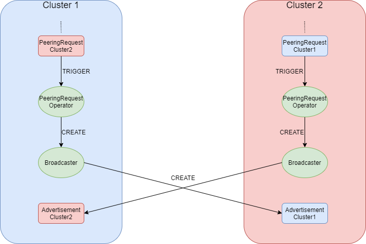

# Broadcaster

## Overview
The broadcaster is in charge of sending to other clusters the `Advertisement` CR, containing the resources made available 
for sharing and (optionally) their prices. 
It is created after the receipt of a `PeeringRequest` from a foreign cluster, which is requesting some resources.

After having created the Advertisement on the remote cluster, the broadcaster starts watching it, to know the events that occur over it
(e.g. the Advertisement has been accepted/refused, a network remapping is needed...).

### Features
* Dynamic computation of the shared resources

  The computation of the resources shared through the Advertisement considers the following parameters:
    - the total amount of resources in the physical nodes of the cluster
    - the amount of resources currently used by Running pods
    - the sharing percentage set in `ClusterConfig` CR
 
   SharedResources = (TotalAvailability - TotalUsageByPods) * SharingPercentage
* Periodic creation of the Advertisement

   The Advertisement is sent every 10 minutes to the foreign cluster.
* Dynamic creation of the Advertisement when the configuration changes

   The broadcaster watches `ClusterConfig` CR: when the sharing percentage is modified, it creates an Advertisement with the new
   amount of resources and immediately pushes it on the foreign cluster, without waiting for the periodic creation.

### Limitations
* More complex policies (e.g. differentiate Advertisement on the base of the foreign cluster)
* MetricsAPI to have more precise values of available resources

## Architecture and workflow

1. A `PeeringRequest` is created by the foreign cluster: a broadcaster deployment is launched
2. Get the resources available in the cluster considering all its physical nodes
3. Get the resources used by all running pods in the cluster
4. Compute available resources in the cluster
5. Apply SharingPercentage taken by `ClusterConfig` to get the resources to be advertised
6. Prepare an `Advertisement` with the computed resources
7. Create on the foreign cluster a `Secret` with the needed permissions for sharing (i.e. define which operations are allowed on which resources)
8. Create the `Advertisement` on the foreign cluster and start watching it
9. When the `Advertisement` is modified by foreign cluster modules (for example to notify the Advertisement has been accepted,
   or that a PodCIDR remapping is necessary), the watcher is triggered and, if needed, reacts in some way
   (e.g. update foreign cluster `Advertisement` with the remapped PodCIDR set in the `Advertisement` Status)
