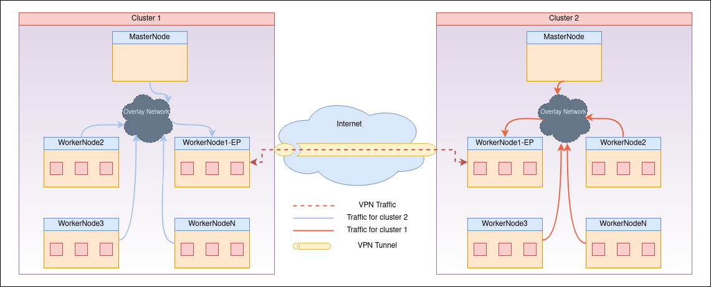

# Liqonet
Liqonet is in charge of connecting networks of different Kubernetes clusters. It is made of three Kubernetes operators:
* [tunnelEndpointCreator-operator](liqonet_tunEndCreator.md);
* [route-operator](liqonet_routeOperator.md);
* [tunnelEndpoint-operator](liqonet_tunnelEndpoint.md).

The module enables Kubernetes clusters to exchange only the POD traffic, which means that only the POD CIDR subnet of a remote cluster is reachable by a local cluster.
Thanks to the [resource reflection](resource_sharing.md) pods and nodes of a local cluster can reach also the pods running behind a service in a remote cluster.

## Architecture
The following image shows the basic architecture of liqonet.

  

More information on the operators can be found on their relative section.

### Network Path
The way how the traffic flows from one cluster two another varies depending on the origin/destination.
All the traffic leaving a cluster or reaching it has to pass through the endpoint/gateway node.
Having traffic originated on the node of a local cluster it is routed through the overlay network toward the gateway node;
After that it is sent through the VPN tunnel and reaches the remote cluster gateway node where it is handled by the CNI of the cluster in order to reach the destination pod. 

### Workflow

The initialization network connection between two cluster goes through the following steps:
1. a `protocol.liqo.io` custom resource called **Advertisement** is created in the local cluster by peering cluster;
2. the tunnelEndpointCreator reacts and from this **Advertisement** derives a **TunnelEndpoint** custom resource of type `liqonet.liqo.io`;
3. the IPAM embedded in the tunnelEndpointCreator resolves possible conflicts between the subnet used in the local cluster and the pod CIDR used by the peering cluster;
4. the Remote Watcher on the peering cluster checks the **TunnelEndpoint CR** on the local cluster if the NAT is enabled and updates the **CR** on the peering cluster accordingly;
5. the local Remote Watcher does the same thing with the **TunnelEndpoint CR** on the peering cluster to check if the NAT has been enabled by the peering cluster and updates the **CR** on the local cluster;
6. the TunnelOperator reacts to the update on the **CR** and creates a VPN tunnel with the gateway on the peering cluster;
7. the TunnelOperator updates the **CR** with information about the VPN Tunnel
8. the RouteOperator has now all the required info to insert the routing and iptables rules in order to reach the peering cluster's pods.

